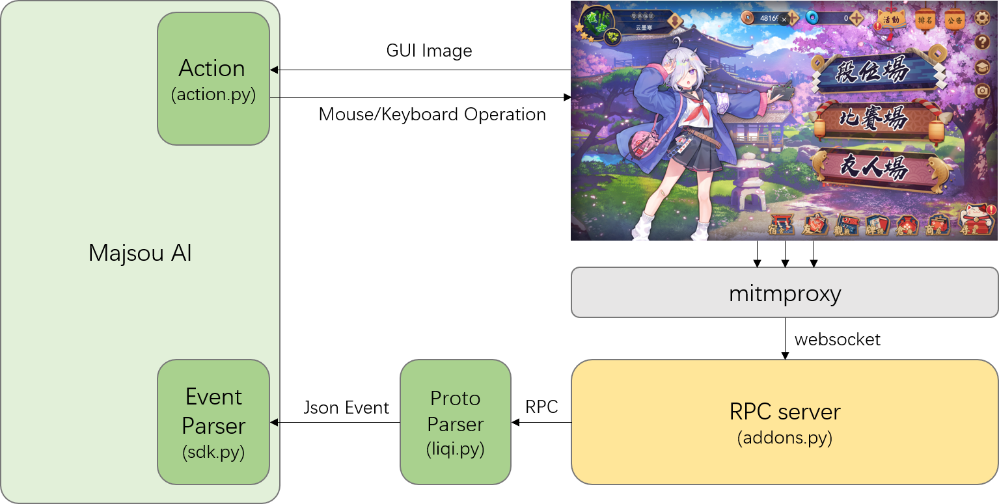
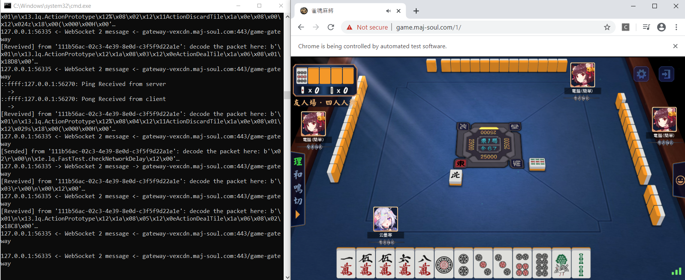
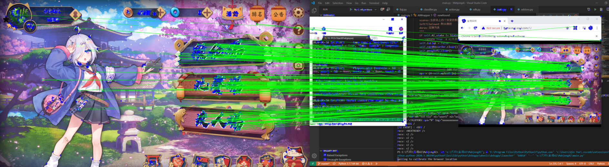
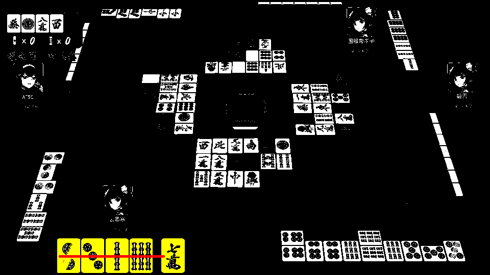

# majsoul_wrapper
[雀魂(Mahjong Soul)](http://www.maj-soul.com/)是一款猫粮工作室开发的一款多人在线日本麻将游戏。

**majsoul_wrapper**封装了基于websocket抓包的输入接口(input)与基于图像识别的鼠标操作输出接口(output)，作为sdk供第三方AI调用，以实现自动化在《雀魂》中打麻将。一个使用majsoul_wrapper的MajsoulAI示例可以参考[这里](https://github.com/747929791/MajsoulAI)。



## 使用说明

### 开启mitmproxy

**majsoul_wrapper**使用[mitmproxy](https://github.com/mitmproxy/mitmproxy)以中间人攻击(Man-in-the-middle Attack)的形式抓取经过代理服务器的网络通信。
如果你还没有安装mitmproxy，那么需要先安装:

```bash
$pip install mitmproxy
$mitmdump --version
```

如果你正处在majsoul_wrapper的目录中，可以通过以下命令开启mitmproxy控制台进程:
```bash
$mitmdump -s addons.py
```

如果你正在将majsoul_wrapper作为PyPI第三方Package使用，可以通过以下命令开启mitmproxy进程:
```bash
$python3 -m majsoul_wrapper
```

上述这两种方式是等价的。在开启mitmproxy后，将会在本地**37247**端口开启**xmlrpc服务**，任何第三方程序均可通过远程过程调用获取mitmproxy抓取的websocket原始二进制报文与websocket报文对象。

在开启mitmproxy的同时，程序会自动打开Chrome浏览器并绑定至mitmproxy的代理服务器端口，mitmproxy仅会截获由上述命令打开的Chrome浏览器中的流量数据。打开浏览器的过程需要安装selenium并正确配置ChromeDriver，安装selenium可以输入:
```bash
$pip install selenium
```
配置ChromeDriver可以参考[这里](https://chromedriver.chromium.org/)，将对应版本的ChromeDriver简单的添加至环境变量即可。

在浏览器弹出后，即可登录至雀魂官网至主菜单。一切就绪后，你应该看到如下画面，并看到持续的websocket数据在终端中显示：


mitmproxy启动后会缓存最新的一个WebSocketFlow对象以及该对象所有的收发数据包。第三方程序可以使用RPC获得mitmproxy记录的所有websocket数据：
```python
import pickle
from xmlrpc.client import ServerProxy

server = ServerProxy("http://127.0.0.1:37247")   # 初始化服务器
n = server.get_len()                             # websocket中数据包的总数
flow = pickle.loads(server.get_items(0, n).data) # 获得所有数据对象的列表
flow_msg = pickle.loads(server.get_item(0).data) # 获得第0号数据对象
buffer = flow_msg.content                        # 数据二进制内容
from_client = flow_msg.from_client               # 数据是否来自客户端
```

### websocket解析

**majsoul_wrapper**提供了**liqi.py**和**sdk.py**两个不同层次的工具来帮助分析websocket数据，在下文中`$python liqi.py`与`$python -m majsoul_wrapper.liqi`是等价的,sdk.py同理。

解析雀魂websocket数据需要安装[protobuf](https://github.com/protocolbuffers/protobuf)：
```bash
$pip install protobuf
```

**liqi.py** 通过反解析liqi proto粗略的将websocket二进制数据解码为Json与Dict可解释对象。


```bash
$python liqi.py --dump FILE # 将mitmproxy消息对象缓存至FILE
$python liqi.py --load FILE # low level的解析FILE并打印至stdout
```

运行liqi.py一个期待得到的结果应类似：

```
...

{'id': 1082, 'type': <MsgType.Res: 3>, 'method': '.lq.FastTest.checkNetworkDelay', 'data': {}}
-----------------------------------------------------------------
{'id': 660, 'type': <MsgType.Notify: 1>, 'method': '.lq.ActionPrototype', 'data': {'step': 52, 'name': 'ActionChiPengGang', 'data': {'seat': 3, 'tiles': ['5m', '6m', '7m'], 'froms': [3, 3, 2], 'tileStates': [0, 0]}}}
-----------------------------------------------------------------
{'id': 1083, 'type': <MsgType.Req: 2>, 'method': '.lq.FastTest.checkNetworkDelay', 'data': {}}
-----------------------------------------------------------------
{'id': 1083, 'type': <MsgType.Res: 3>, 'method': '.lq.FastTest.checkNetworkDelay', 'data': {}}
-----------------------------------------------------------------
{'id': 663, 'type': <MsgType.Notify: 1>, 'method': '.lq.ActionPrototype', 'data': {'step': 53, 'name': 'ActionDiscardTile', 'data': {'seat': 3, 'tile': '9s'}}}
-----------------------------------------------------------------
{'id': 664, 'type': <MsgType.Notify: 1>, 'method': '.lq.ActionPrototype', 'data': {'step': 54, 'name': 'ActionDealTile', 'data': {'leftTileCount': 43}}}

...
```

**sdk.py** 以更高层次的抽象进一步解析liqi proto，将websocket动作绑定至一系列[回调函数](https://github.com/747929791/majsoul_wrapper/blob/9faecc9090c3025dd6e705fd29d5cb5137ecc78b/sdk.py#L186)，这一组函数提供了实现一个雀魂AI的全部动作（参数含义详见sdk.py注释），这些函数包含两个部分：

局面信息输入(Input):
| 函数名 | 功能 |
| -| - |
|*authGame*|开始整场对局，告知AI自己的座次|
|*newRound*|新的一轮，初始手牌、座次、分数与明宝牌|
|*discardTile*|某一个玩家打出一张牌|
|*dealTile*|某一个玩家(非自己)摸了一张牌|
|*iDealTile*|自己摸了一张牌|
|*chiPengGang*|某玩家吃碰杠了|
|*anGangAddGang*|某玩家暗杠加杠了|
|*hule*|某玩家胡牌了|
|*liuju*|流局了|
|*beginGame*|在整场比赛开始前调用|
|*endGame*|在整场比赛结束后调用|

AI动作反馈(Output):
| 函数名 | 功能 |
| -| - |
|*actionDiscardTile*|普通的出牌|
|*actionLiqi*|立直并出牌|
|*actionHu*|我要和牌|
|*actionZimo*|我要自摸|
|*actionChiPengGang*|我要吃、碰、杠|

任何一个通过mitmproxy作为输入的雀魂AI都应继承*MajsoulHandler*，并重载其所有除了*parse*以外的动作函数（一个AI代码示例可以参考[MajsoulAI](https://github.com/747929791/MajsoulAI)）。

我们可以直接运行sdk.py来简单的观察所有可解释的动作：

```bash
$python sdk.py --dump FILE # 将mitmproxy消息对象缓存至FILE
$python sdk.py --load FILE # high level的解析FILE并打印至stdout
```

运行sdk.py一个期待得到的结果应与上面类似的：

```
...

discardTile (seat = 0, tile = '3s', moqie = False, isLiqi = False, doras = [], operation = None)
dealTile (seat = 1, leftTileCount = 51, liqi = None)
discardTile (seat = 1, tile = '7s', moqie = False, isLiqi = False, doras = [], operation = {'seat': 2, 'operationList': [{'type': 2, 'combination': ['5s|6s', '6s|8s']}], 'timeAdd': 20000, 'timeFixed': 5000})
chiPengGang (type_ = 1, seat = 3, tiles = ['7s', '7s', '7s'], froms = [3, 3, 1], tileStates = [0, 0])
discardTile (seat = 3, tile = '5z', moqie = False, isLiqi = False, doras = [], operation = None)

...
```

项目提供了一个websocket消息流的样例文件"ws_dump.pkl"可以参考。

### 动作输出

当AI通过MajsoulHandler获取局面信息，并作出决策以后，需要向雀魂服务器发出动作反馈。我们提供了一个基于图像识别的动作模块GUIInterface，该模块通过模拟鼠标操作的方式执行AI的动作。GUIInterface重写了MajsoulHandler中所有未实现的5个AI动作反馈函数，以及一系列辅助函数。

| 函数名 | 功能 |
| -| - |
|*calibrateMenu*|校准界面位置(需保持雀魂主菜单完整的悬浮于桌面上)|
|*actionBeginGame*|从主菜单开始一场段位场匹配|
|*actionDiscardTile*|普通的出牌|
|*actionLiqi*|点击'立直'并出牌|
|*actionHu*|点击'和'按钮|
|*actionZimo*|点击'自摸'按钮|
|*actionChiPengGang*|点击'吃、碰、杠'按钮|
|*clickCandidateMeld*|如果有多种'吃'法时的二次选择|
|*actionReturnToMenu*|在对局结束后返回至主菜单|

在使用时只需让AI继承majsoul_wrapper.GUIInterface，在初始化时调用calibrateMenu，并在AI运行过程中始终保持Chrome悬浮于桌面顶部。唯一需要特殊处理的是*clickCandidateMeld*，因为是否需要二次选择取决于input和AI维护的手牌信息（一个AI代码示例可以参考[MajsoulAI](https://github.com/747929791/MajsoulAI)）。

使用基于GUI的动作输出需要安装pyautogui与OpenCV-Python：
```bash
$pip install pyautogui opencv-python
```
另外还需安装对应版本的[Pytorch](https://pytorch.org/get-started/locally/)。由于图像识别使用了神经网络，如果需要使用GPU加速而非CPU还需安装对应版本的[CUDA](https://developer.nvidia.com/cuda-downloads)（虽然CPU也可以很快的计算出结果）。

至此你已经可以尽情的开心自动雀魂了 : )

## majsoul_wrapper的原理

### 信息获取(Input)

雀魂的数据是实时websocket，在进入主菜单后会开启第一层websocket长连接，在每一局对局开始时会发起对局专用websocket链接，我们抓包的重点在对局数据这部分，以提供实时局面信息。

#### 通信格式(Liqi Proto)

在雀魂与浏览器之间的websocket数据由**消息头**+**Protobuf载荷**两部分构成，消息头有三种类型：
| 消息类型 | 编码格式 | 首字节 | 用途 |
| - | - | - | - |
|Notify|1+n|0x01|服务器向客户端发送通知|
|Request|1+2+n|0x02|客户端向服务器发送请求|
|Response|1+2+n|0x03|服务器回复客户端的请求|

如果消息类型为req或res，则第2,3字节按小端序存储16bit滑动窗口消息id，这样可以将乱序出现的req和res对应上。

后n字节采用[protobuf](https://github.com/protocolbuffers/protobuf)编码，n字节分为两个层次，第一层固定为`{'methodName':str, 'data':protobufBytes}`，可以手动解析出*methodName*，*data*部分的protobuf编码协议是在雀魂游戏加载过程中下载的，会不定时更新，目前项目中./proto已同步0.8.1.w版本的liqi proto，如有更新可按如下方式同步新proto：

在打开浏览器雀魂登录页面时会加载liqi.json，可用Chrome F12抓出放于proto文件夹中。liqi.json是以json编码的protobuf格式，需编译成liqi_pb2.py。

编译过程先借助[protobuf.js](https://github.com/protobufjs/protobuf.js)将liqi.json编译为liqi.proto，以nodejs为例：

```bash
$npm install -g protobufjs
$pbjs -t proto3 liqi.json > liqi.proto
```
然后使用protobuf将liqi.proto编译为liqi_pb2.py将旧版proto替换即可。
```
protoc --python_out=. liqi.proto
```

有了liqi_pb2.py以后就可以在parse过程中根据*methodName*反射的构造protobuf对象进行解析，最终通过MessageToDict转为Python Dict对象。

### 动作输出(Output)

动作输出使用[pyautogui](https://github.com/asweigart/pyautogui)截屏并进行鼠标操作。由于实时对局效率是至关重要的，因此我们使用OpenCV进行快速的图像定位，使用CNN进行牌的分类。

在一切开始之前需要使用GUIInterface.calibrateMenu校准雀魂界面的坐标。我们需要得到1920x1080的模板到当前雀魂界面位置的单应矩阵，这使得无论浏览器在哪里，无论当前分辨率如何，都能够找到正确的位置。我们使用ORB特征提取与FLANN特征匹配快速的得到匹配点对，进而通过RANSAC得到单应矩阵的估计。虽然大多数时候校准都是准确的，但如果你想要得到更好的校准效果，可以尝试用自己的1920x1080屏幕截图替换./action/template/menu.png。



对局中我们需要定位与识别13张手牌以及有多种'吃'方式时的候选操作牌。牌区域分割使用固定阈值的floodfill，沿直线搜索。牌的识别使用简单的两层CNN实现(action/classify.py)。



对于吃碰杠等图标的定位，由于已经得到了单应矩阵，可以简单的通过基于FFT的template matching十分快速地实现。

## 免责声明

该第三方工具需监听网络通信并主动以**中间人攻击**的形式窃取websocket数据，但除了过滤雀魂对局信息并提供RPC服务以外**不会窃取个人隐私**，也**不会篡改网络数据**(如有担心可核验[addons.py](https://github.com/747929791/majsoul_wrapper/blob/master/addons.py))。如果使用该工具自动出牌，将会主动在特定位置点击鼠标。请自行判断使用该工具的风险,如果滥用该工具或（不存在的）该工具的衍生物产生的一切后果，包括**电脑损坏、数据丢失、账号被封禁**等，作者均不承担任何责任。


